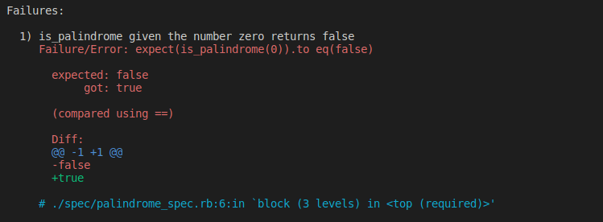
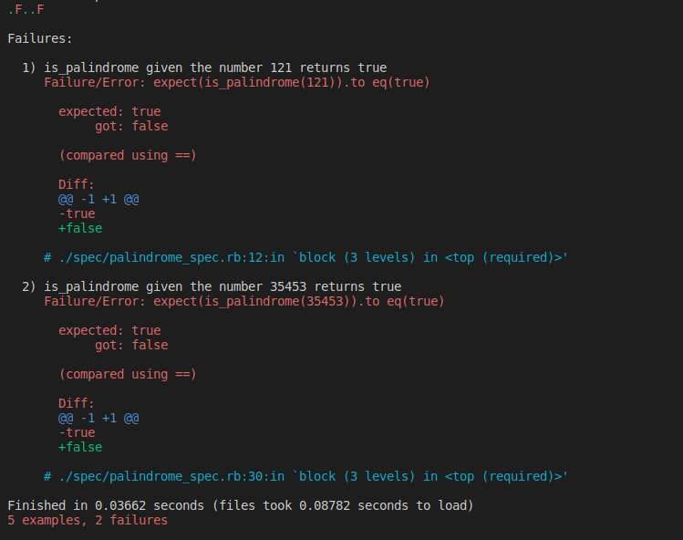

<div align="center">
  <h3><b>Section A: Option 3 Ruby Task Review</b></h3>
</div>

<br>
<br>

Excellent work so far! 👏🏾👏🏾👏🏾  
You have done a great job creating an algorithm to determine whether an integer is a palindrome as per project requirements project requirements.🥳  
There are a few issues that you still need to work on to improve your solution. You are almost there! 💪🏾 

<br>

<hr>

## Highlights 🌞 
<hr>

✔️  Great use of pseudo code to explain your solution. This makes it easy fo get an idea of your thought process while implementing your algorithm.  
✔️  Your code is clean, organized, and easy to read.

<br>

<hr>

## Required Changes ♻️
<hr>

### Correctness

#### Syntax
> When running tests on your solution I encounter the following [SyntaxError](https://en.wikipedia.org/wiki/Syntax_error).

```
SyntaxError:
  /Reviews/hyperiondev-cr-test/Section A/Option 3: Ruby Task/palindrome.rb:27: syntax error, unexpected end-of-input, expecting `end'
      end
         ^
```

- This is due to the missing `end` keyword that is required to close every Ruby method. In your case, the `is_palindrome` method should be closed with `end` on `line 28`.

<br>

#### Validation
> The number input to reverse must not equal 0. Therefore, on `line 3` the `if` statement should use the `<=` operator.



<br>

#### Typos
> On `line 11`, the variable `reversd` is misspelled. This is conflicting with how the variable is spelled `reversed` everywhere else on the algorithm.

This results in a [NameError](https://www.thoughtco.com/nameerror-undefined-local-variable-2907927#:~:text=Why%20You're%20Getting%20This,intended%20to%20enter%20a%20string.) due to the undefined `reversed` variable that is used but not declared, and an `unused variable` warning due to `reversd` being declared but never used.

<br>

#### Test Cases
> When running tests on your solution, there are a couple of tests that do pass as illustrated on the snapshots below.



- On test case 1), the number 121 is a palindrome. From left to right, it reads 121. From right to left, it reads 121. Therefore, the method should return `true`.
- On test case 2), the number 35453 is a palindrome. From left to right, it reads 35453. From right to left, it reads 121. Therefore, the method should return `true`.

<br>

### Efficiency
> I like your minimalist approach in reversing the the number in order to compare it with the input. However, the is a way you can improve the code between `line 11` and `line 19` in order to reduce [time complexity](https://www.mygreatlearning.com/blog/why-is-time-complexity-essential/#:~:text=Time%20complexity%20is%20defined%20as,of%20code%20in%20an%20algorithm.) and avoid runtime errors caused by infinite loops.

There are several Ruby methods you case use to reverse the number in just one line of code. Kindly consider the following line of code:

```
reversed = x.to_s.split('').reverse().join('').to_i
```

Note: These are non-mutating methods which means that they do not change the original number but create a copy.

- **to_s** converts the argument `x` to a string in order to use string methods like `split`.
- **split('')** converts the now string `x` to an array separating each string digit into an array item.
- **reverse()** reverses the order of the array items from last to first.
- **join('')** joins the now reversed array items back into a single string.
- **to_i** converts the now reserved string back into an integer.

<br>

### Documentation

> Well done using comments to explain each line of code. This makes you code easy to follow. 💯 🎊 🥳

<br>

### Best Practices
> In the repo I used the [.rubocop.yml](.rubocop.yml) config file to check for linter errors. I ran into a couple of issues with your code. Linter checks help with making sure that you are following industry-standards and Ruby best practices when writing your code. I highly recommend that you use `Rubocop` to clean up your code. `Rubocop` can also help you identify syntax errors and typos in your code.

You can utilize rubocop by following these instructions.

1. Include the [.rubocop.yml](.rubocop.yml) config file in the root directory of your project.
2. Include the `Rubocop` gem in your Gemfile `gem 'rubocop', '>= 1.0', '< 2.0'` and make sure that the gem is installed using `bundle install`.
3. Test for Rubocop offenses by running `rubocop` on the terminal.
4. auto-fix all fixable Rubocop errors by running `rubocop -A` on the terminal.