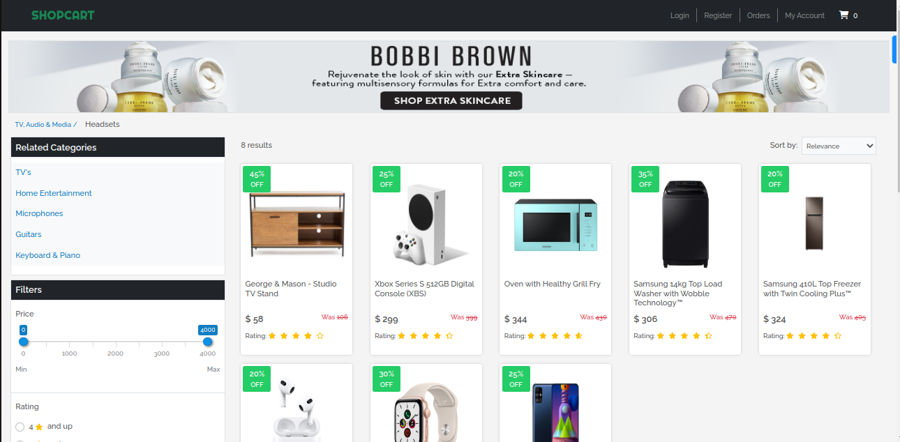

  <h1><b>Section B: Projects</b></h1>

## Live Demo

Website: [Shopcart](https://shopcart-v1.netlify.app/)  
GitHub: [Repo](https://github.com/KDlamini/bamboo-client)

 

 

## Shopcart

> Shopcart is the perfect market for high quality products supplied worldwide. We provide a platform for buyers and sellers to connect and trade products and services. Built with React, NodeJS, Express, and MongoDB Atlas.

 

## Why I am proud of this project

> Although this a common application created by most junior developers, I picked this project not because of uniqueness but rather the skills I developed due to it's variety of features and technologies required. I am proud of building a MERN stack eCommerce application because it showcases my skills and knowledge in web development. I have learned how to use MongoDB, Express.js, React.js, and Node.js to create a full-stack web application that can handle complex functionalities such as user authentication, filters, search, cart, inventory control, payments, and orders. I have also learned how to integrate external APIs such as JWT and Stripe to enhance the security and functionality of my application.

### Some of the features that I found challenging but rewarding to implement were:

- Filters for products and departments: I had to design an algorithm that can filter the products based on multiple criteria such as category, price range, ratings, and brand. I also had to sync the filters with each other so that they can update dynamically based on the user’s selection.
- Payments with Stripe: I had to configure Stripe to accept payments from customers and process orders. I also had to handle errors and edge cases such as invalid card details or insufficient funds.
- Orders: I had to create a schema for storing order details in MongoDB and display them on the user’s profile page. I also had to update the inventory status of the products after each order.

### Some of the features that I intend on implementing in the future are:

- Content Management System (CMS): This would allow me to manage users, promotions, products, inventory, and suppliers from a single dashboard. It would also make it easier for me to add or delete products or update their details.
- Pagination: This would improve the performance and user experience of my application by loading only a limited number of products per page instead of all at once.
- Tracking orders: This would allow customers to track their orders’ status and delivery date using a tracking number provided by Stripe or another third-party service.
- Application page for local suppliers: This would allow local suppliers who wish to sell their products on my platform to register and upload their product details. It would also help me expand my product range and support local businesses.

